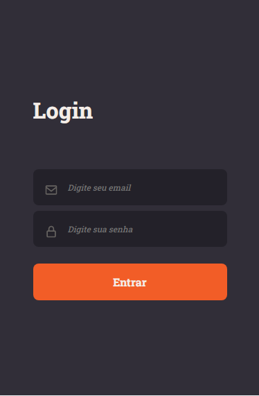

<h1 align="center">
  
</h1>

<h2 align="center"> 


</h2>

<div align="center">
     <div>
        <p>Web</p>
        
     </div>
     <div>
        <p>Mobile</p>
        
     </div>
</div>

<h2 align="center">
  <a href="#-tecnologias">Tecnologias</a>&nbsp;&nbsp;&nbsp;|&nbsp;&nbsp;&nbsp;
  <a href="#-projeto">Projeto</a>&nbsp;&nbsp;&nbsp;|&nbsp;&nbsp;&nbsp;
  <a href="#-como-usar?">Como usar?</a>&nbsp;&nbsp;&nbsp;&nbsp;&nbsp;&nbsp;
</h2>

## 🛠 Tecnologias 🚀

Este projeto foi desenvolvido com as seguintes tecnologias:

- <a href="https://pt-br.reactjs.org/">Nextjs</a>
- <a href="https://www.typescriptlang.org/">Typescript</a>
- <a href="https://sass-lang.com/">SASS</a>
- <a href="https://yarnpkg.com/">Yarn</a>

## 💻 Projeto

<p>NextAuth é uma aplicação para autenticação( login ) e controle de acesso de usuário através da utilização de JWT por parte do backend.</p>
<p>O objetivo de sua criação foi colocar em prática conceitos estudados referentes a implementação de um fluxo completo de autenticação com JWT</p>
<p>Ao longo do projeto foram implementadas as seguintes funcionalidades:</p>
<ul>
  <li>Login com JWT</li>
  <li>Refresh Token</li>
  <li>Login com Server Side Rendering</li>
  <li>Validação de permissões</li>
</ul>

## ⌨ Como usar?

Em primeiro lugar, clone o repositório responsável pelo backend:

```bash
#Clonando o repositório
git clone https://github.com/rocketseat-education/ignite-reactjs-auth-backend.git

#Instale as dependências:
yarn install

#Inicie a aplicação backend
yarn dev
```
Na sequência, clone o repositório responsável pelo front-end:

```bash
# Clonando o repositório
git clone https://github.com/hitaloalvess/nextauth.git

# Instale as dependências:
yarn install

# Inicie a aplicação front-end
yarn dev
```

---
Made with ♥ by Hitalo 🚀
